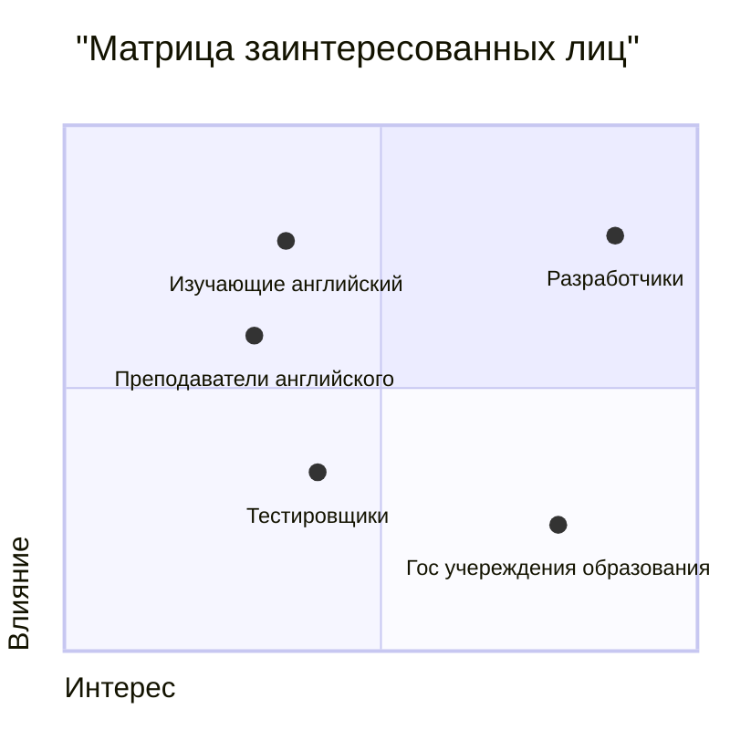

# Список операций

| Операция  | Срок выполнения |
| ------------- | ------------- |
| Проработка концепции  | 2 недели |
| Исследование рынка образовательных платформ | 3 недели  |
| Определение целевой аудитории и её потребностей  | 2 недели |
| Технико-технологический анализ | 3 недели  |
| Экономический анализ | 3 недели  |
| Определение основных функциональных возможностей | 2 недели  |
| Создание прототипа интерфейса | 1 недели  |
| Описание требований к программному обеспечению | 3 недели  |
| Выбор технологий  | 2 недели |
| Создание структурной схемы сервиса | 4 недели  |
| Проектирование базы данных  | 1 месяц |
| Разработка основных функций сервиса | 3 месяца  |
| Тестирование и отладка  | 1 месяц |
| Проведение закрытого тестирования среди ограниченного числа пользователей | 2 недели  |
| Изменения на основе отзывов | 2 месяца  |

# Обоснование выбора решения

Был выбран Python - поскольку для анализа текста он является хорошим решением
В его рамках стоял выбор между Tesseract и Paddle OCR

Tesseract
| Преимущества  | Недостатки |
| ------------- | ------------- |
| Бесплатный и открытый исходный код: Tesseract распространяется под лицензией Apache 2.0, что позволяет использовать и модифицировать его бесплатно  | Требует предварительной обработки изображений: Для достижения хороших результатов Tesseract часто требуется предварительная обработка изображений, такая как бинаризация или улучшение контраста |
| Широкая платформенная поддержка: Tesseract доступен для Windows, macOS и Linux | Менее точное распознавание на сложных изображениях: На сложных или нестандартных изображениях Tesseract может показать менее точные результаты.  |
| Большое сообщество: Из-за своей популярности Tesseract имеет большое сообщество разработчиков, что упрощает получение поддержки и решение проблем  | - |

Paddle OCR
| Преимущества  | Недостатки |
| ------------- | ------------- |
| Высокая скорость и эффективность: Paddle OCR основан на глубоком обучении и может обрабатывать изображения с высокой скоростью без значительной потери качества | Требует графического процессора (GPU): Для работы Paddle OCR с высокой скоростью рекомендуется использовать графический процессор, что может увеличить стоимость инфраструктуры  |
| Хорошая точность на разнообразных изображениях: Благодаря использованию современных алгоритмов машинного обучения, Paddle OCR может эффективно распознавать текст на разнообразных типах изображений | Сложнее для настройки: Поскольку Paddle OCR использует сложные алгоритмы глубокого обучения, его настройка и оптимизация могут потребовать дополнительных усилий и знаний в области машинного обучения  |
| Простота интеграции: Paddle OCR предоставляет простые API для интеграции с различными приложениями и сервисами | -  |

Следовательно Paddle OCR подхоидт для более сложных и требовательных задач, где необходима высокая точность и скорость распознавания, а Tesseract подходит для простых задач распознавания текста.

Поскольку в игрых порой встречается необычно расположенный текст [Persona 5], а 30-ти минутный геймплейный ролик имеет 30*60=1800 кадров по 1й секунде, то здесь важна и скорость и хорошая точность. Поэтому я выбрал Paddle OCR

